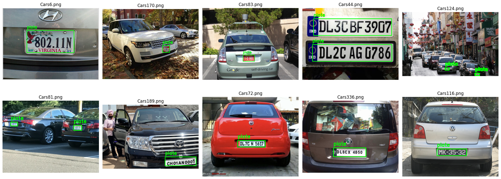

# 🚗 Car Plate Detection with YOLOv11

This project demonstrates how to detect vehicle license plates using the **YOLOv11** object detection model. It uses a public dataset of annotated car images, processes the data, and trains a YOLOv11 model to accurately identify license plates.

---

## 📁 Dataset

- **Source**: Public dataset containing vehicle images with annotated license plates.
- **Format**: Annotations in **Pascal VOC (XML)** format.
- **Preparation**: Annotations are converted to **YOLO-compatible format** and organized for training.

---

## 📊 Project Workflow

### 1. **Dataset Acquisition**

The dataset was downloaded and extracted. A few images were visualized with bounding boxes to verify annotation accuracy.

### 2. **Annotation Conversion**

The XML annotations were converted into YOLO format. Bounding box coordinates were normalized, and each object was assigned a numeric class label.

### 3. **Data Organization**

The dataset was split into **training** and **validation** sets (typically 80/20 split) and structured in the YOLOv11 directory format:
- Separate folders for images and labels
- Train and validation subfolders

### 4. **Model Training**

The YOLOv11 model was trained on the prepared dataset. The training process involved monitoring several metrics:
- **Box Loss**
- **Classification Loss**
- **Precision & Recall**
- **mAP (mean Average Precision)**

### 5. **Evaluation & Visualization**

The trained model was tested on unseen validation data. Predictions were visualized with bounding boxes to confirm the model’s ability to detect license plates accurately.

---

## 📈 Results

- **High accuracy** in detecting license plates.
- **Consistent improvements** in training metrics across epochs.
- Visual results confirm strong **generalization** to new, unseen images.

### 🖼️ Sample Output

> *The above image is stored as `Sample.png` in this repo.*

---

## 🚀 Future Improvements

- 🔠 Add **OCR integration** to read the license plate numbers.
- 🎥 Extend to **real-time video detection**.
- ⚙️ Experiment with different YOLOv11 model sizes and **fine-tune hyperparameters**.

---

## 📜 License

This project is for **educational and research purposes only**. Please consult the dataset and model licenses before commercial use or redistribution.
